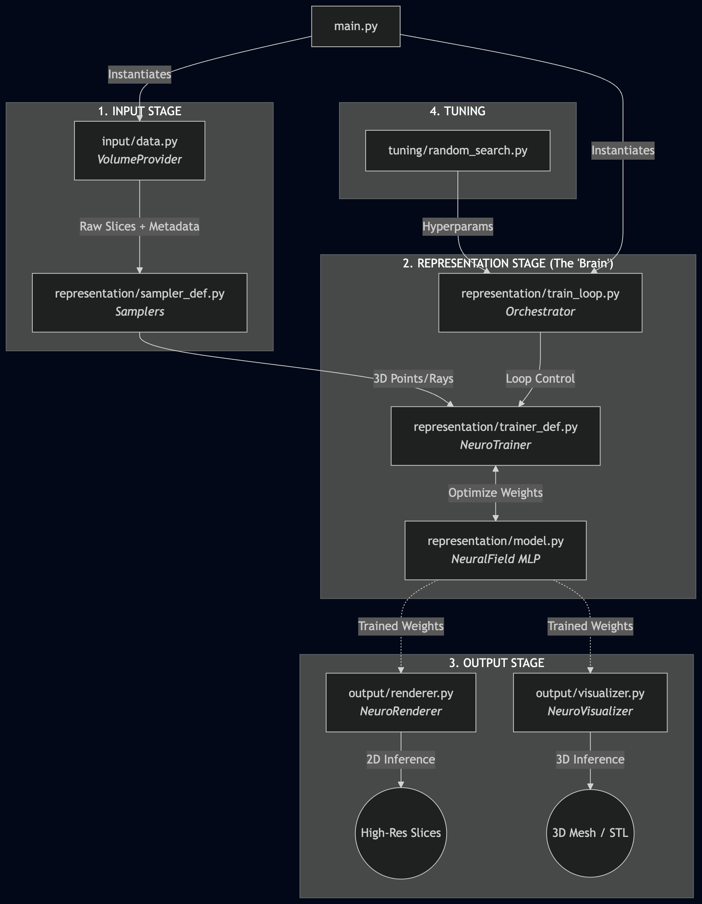

# Neuro-NeRF: 3D Brain Reconstruction from Volumetric MRI

## 🎯 Project Motivation
The core motivation of this project is to generate a high-fidelity 3D model of a human brain using 2D MRI scans. We apply the **Neural Radiance Fields (NeRF)** approach, specifically by **overfitting a Multilayer Perceptron (MLP)** to a set of 2D slices. 

Unlike traditional methods that treat scans as a static grid of voxels, this project treats the brain as an **Implicit Neural Representation (INR)**. This means the 3D structure is not stored in a table, but is "memorized" within the weights of the neural network as a continuous mathematical function:
$$f(x, y, z) \rightarrow \text{Intensity}$$
Once the network has converged, we can recreate the entire 3D structure by querying the MLP at any coordinate.

## 🏁 Goals
By representing the brain as a neural field, we aim to:
1.  **Metric Comparison:** Evaluate the quality of the reconstruction against different representation techniques (e.g., Point-Sampling vs. Ray-Slab) using standard metrics such as PSNR and SSIM.
2.  **Visualization:** Generate high-quality visual outputs by rendering the reconstructed 3D models and arbitrary cross-sections from the learned scene.

## 🛠 Approach
As this project serves as an experiment to gain familiarity with NeRF concepts, it follows a **strictly modular design**. This architecture allows for easy comparison of different sampling and encoding strategies with minimal code changes.

### System Architecture
Responsibilities are decoupled across specialized modules. Each file provides a specific API (detailed in the individual file headers):



## 🧪 Scientific Background

### What is an MRI?
Magnetic Resonance Imaging (MRI) measures the signal intensity of hydrogen protons in the body. The scanner produces a stack of 2D "slices." A significant challenge in clinical imaging is **slice thickness** (anisotropy); data is often missing in the gaps between these slices.

### Our Approach vs. Classical NeRF
*   **Classical NeRF:** Uses 2D photos from external camera angles to learn RGB color and density (opacity) for solid surfaces.
*   **Neuro-NeRF:** Uses internal 2D slices. Because MRI data is "transparent" (volumetric), there is no occlusion (objects blocking each other). Our network directly learns the **Signal Intensity** at every point in space. We use this to physically interpolate the gaps between slices (**Super-Resolution**).

---

## 🚀 Getting Started

### 1. Installation
```bash
pip install torch numpy matplotlib nibabel nilearn scikit-image tensorboard
```

### 2. Run the MVP Test (Hollow Cube)
Verify the 3D logic and coordinate mapping using a synthetic layered cube:
```bash
python main.py
```

### 3. Hyperparameter Tuning
Start a random search to find the best configuration for a specific volume:
```bash
python -m tuning.random_search
```

### 4. Monitoring
Visualize real-time loss curves via TensorBoard:
```bash
tensorboard --logdir=runs
```

---

## 🗺 Roadmap
- [x] **Phase 1:** Modular MVP architecture with synthetic data support.
- [x] **Phase 2:** Implementation of Random Search for hyperparameter optimization.
- [ ] **Phase 3:** Validation with real-world human brain MRI data (NIfTI).
- [ ] **Phase 4:** Experiments with Grid-Cell-inspired spatial encodings (Neuroscience Tangent).
- [ ] **Phase 5:** Integration with Nerfstudio for real-time interactive visualization.

---
*Created for the Course: **Deep Learning for Computer Graphics***